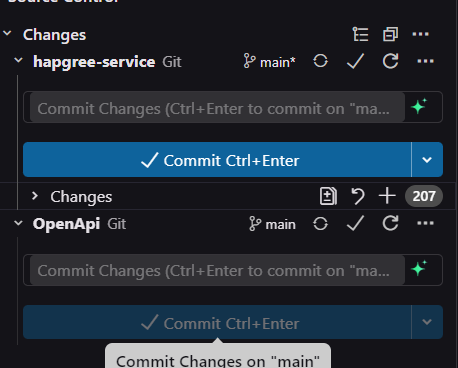

# Git Submodules

Come menzionato nel capitolo [OpenApi](/Capitoli/OpenApi.md), il file di specifica OpenAPI del server è presente in un **submodule** di Git. Ma cosa sono esattamente i submodules?

## Cosa sono i Submodules?

In sostanza, un submodule è come avere una repository Git all'interno di un'altra repository. Questo significa che quando si modifica il contenuto della cartella `ApiDocumentation\OpenApi`, in realtà si sta modificando il contenuto appartenente alla repository Git [HapGreeServerOpenapiSpecification](https://github.com/Commigo/HapGreeServerOpenapiSpecification), e non quella del progetto principale del server.

Questo approccio è utile perché:
- Più progetti possono condividere gli stessi submodules.
- Ogni aggiornamento fatto in un progetto viene automaticamente reso disponibile agli altri progetti tramite un semplice `git pull`.

## Utilizzo nel Progetto

Nel nostro caso, sia il progetto del backend che quello del frontend utilizzano il submodule della specifica OpenAPI, poiché entrambi generano del codice a partire da essa. Di conseguenza, ogni qual volta la specifica viene modificata in uno dei due progetti, l'altro riceve gli aggiornamenti senza la necessità di un intervento manuale.

## Inizializzazione del Submodule

Nel progetto del server, come accennato, viene utilizzato un submodule per la specifica OpenAPI. Se la cartella `ApiDocumentation\OpenApi` risulta vuota, è probabile che il submodule non sia stato inizializzato. Di default, infatti, la repository non scarica i file del submodule a meno che non venga attivata esplicitamente la funzionalità con il seguente comando:

```bash
git submodule update --init --recursive
```

## Gestione con gli IDE

### Visual Studio Code e Trae

Visual Studio Code e Trae gestiscono automaticamente questa funzionalità, mostrando nell'interfaccia di Git i commit e gli aggiornamenti divisi tra il submodule e il progetto principale. Anche nell'interfaccia di commit, è possibile committare in modo separato gli aggiornamenti del progetto e quelli fatti al submodule.



### IntelliJ IDEA

Nelle versioni più recenti di IntelliJ IDEA e IDE simili di JetBrains, la gestione dei submodules dovrebbe essere automatica. In caso contrario, è possibile seguire [questa guida](https://www.stevestreeting.com/2022/09/20/git-submodules-tips-for-jetbrains-ides/) che spiega come configurare l'editor per gestirli correttamente.
